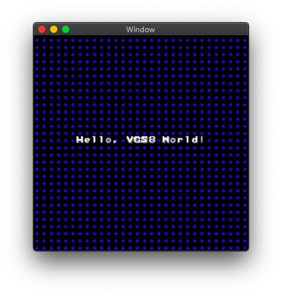

# Hello, VGS8 World! 改

FG/BGを組み合わせつつ、BGスクロールをテスト。

- FG に `Hello, VGS8 World!` というテキストを表示
- BG を 縦スクロール

> 静止画だと分かりにくいですが、背景の青い点が常にスクロールしています。
> これは地味にファミコンだと実現不可能な映像表現です。
> ファミコンの場合、テキスト部分をスプライトで描画する必要がありますが、ファミコンのスプライトは水平方向の描画上限が8x8pxなので。
